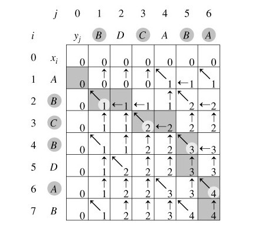

## 题目16： Reverse Vowels of a String
### 描述

```
Write a function that takes a string as input and reverse only the vowels of a string.

Example 1:
Given s = "hello", return "holle".

Example 2:
Given s = "leetcode", return "leotcede".

Note:
The vowels does not include the letter "y".
```

### 解法
1. 先将字符串变为数组，然后取出其中的元音字母;
2. 用之前的取出的元音字母，倒序放回字符串数组;
3. 将字符串数组变为字符串;
4. `/^[aeiou]$/i`这个正则表达式的意思是匹配从aeiou开头到最后不区分大小写的字母

```js
/**
 * @param {string}
 * @return {string}
 */
var reverseVowels = function(s) {
    var vowels = [];  

    for(var i = 0 ; i< s.length ; i++){
        if((/^[aeiou]$/i).test(s[i])){
            vowels.push(s[i]);
        }    
    }

    var v = vowels.length - 1;

    var sAry = s.split("");


    for(var j = 0 ; j < sAry.length ; j++){
        if((/^[aeiou]$/i).test(sAry[j])){
            sAry[j] = vowels[v--];
        }    
    }

    return sAry.join("");
};
```
---

## 题目17： Isomorphic Strings
### 描述

```
Given two strings s and t, determine if they are isomorphic.

Two strings are isomorphic if the characters in s can be replaced to get t.

All occurrences of a character must be replaced with another character while preserving the order of characters. No two characters may map to the same character but a character may map to itself.

For example,
Given "egg", "add", return true.

Given "foo", "bar", return false.

Given "paper", "title", return true.

Note:
You may assume both s and t have the same length.
```

### 解法

这里讲一下我对同构字 `Isomorphic` 的理解，也就是说长度相同，并且每一个字母都能够对应上另外一个字符串中的每一个字母
举个栗子：
```js
a = 'egg';
b = 'add';
// 那么a与b的对应关系就是

mapA: { e: 'a', g: 'd' };
mapB: { a: 'e', d: 'g' };

a = 'foo';
b = 'bar';

mapA: { f: 'b', o: 'a' };
mapB: { b: 'f', a: 'o', r: 'o' };
```
从这两个栗子足以看出，第二个a,b两个字符串的对应关系明显不一致，所以他们不是同构字

```js
/**
 * @param {string} s
 * @param {string} t
 * @return {boolean}
 */
var isIsomorphic = function(s, t) {
    var mapS = {};
    var mapT = {};

    for(var i in s){
        var valueS = s[i];
        var valueT = t[i];

        if(!mapS[valueS]){
            mapS[valueS] = valueT;
        } else if(mapS[valueS] != valueT) { 
            return false;
        }

        if(!mapT[valueT]){
            mapT[valueT] = valueS;
        } else if(mapT[valueT] != valueS) { 
            return false;
        }
    }
    return true;
};
```
---

## 题目18： Valid Parentheses
### 描述

```
iven a string containing just the characters '(', ')', '{', '}', '[' and ']', determine if the input string is valid.+

The brackets must close in the correct order, "()" and "()[]{}" are all valid but "(]" and "([)]" are not.
```

### 解法
这道题比较有趣的，是匹配 `(), [], {}` 三种括号是否配对
这个可以使用堆栈 `stack` 的结构来解：遇到左括号就放入堆栈之中，遇到右括号就把堆栈中的左括号取出来比较是否是一对；

```js
/**
 * @param {string} s
 * @return {boolean}
 */
var isValid = function(s) {
    if(!s) return true;

    // 使用stack還儲存左括號
    var stack = [];

    var left = ['(','[','{'];
    var right = [')',']','}'];
    var match = {
        ')':'(',
        ']':'[',
        '}':'{'
    }

    for(var i in s){
        // 左括號，放入stack
        if(left.indexOf(s[i]) > -1){
            stack.push(s[i]);  
        } 

        // 右括號，從stack取出左括號判斷是否match
        if(right.indexOf(s[i]) > -1){
            var stackStr = stack.pop();  
            if(match[s[i]] != stackStr) {
                return false;
            }
        } 
    }

    // 如果左右括號都match的話，stack應該為空
    return stack.length === 0;
};
```
---

## 题目19： Length of Last Word
### 描述

```
Given a string s consists of upper/lower-case alphabets and empty space characters ' ', return the length of last word in the string.

If the last word does not exist, return 0.

Note: A word is defined as a character sequence consists of non-space characters only.

For example, 
Given s = "Hello World",
return 5.
```

### 解法

```js
/**
 * @param {string} s
 * @return {number}
 */
var lengthOfLastWord = function(s) {
    if(s.length === 0) return 0;
    var sList = s.split(/\s/);
    var realList = sList.filter(r => r.length !== 0);
    if(realList.length === 0) return 0;
    return realList.pop().length;
};
```
---

## 题目20： Longest Common Prefix
### 描述

```
Write a function to find the longest common prefix string amongst an array of strings.
```

### 解法

1. 比對前兩個字串，從頭開始取出相同的部分為共同字首
2. 後面的字串只要與目前的共同字首比對即可
3. ['abcd','abccc','abdec'] ，一開始'abcd','abccc'共同字首前3碼'abc'
4. 接下來只要將'abc','abdec'做比對，發現剩下'ab'，也就是最長的共同字首

```js
/**
 * @param {string[]} strs
 * @return {string}
 */
var longestCommonPrefix = function(strs) {
    if(strs == null || strs.length == 0) return "";

    // same表示目前發現的共同字首，一開始為strs[0]
    var same = strs[0];

    // 只需要比對same跟目前字串共同的字元就好
    for(var i = 1 ; i<strs.length ; i++){
        var str = strs[i];

        // 取目前的字串str跟same相等的部分做為新的same
        var j = 0;
        for(; j < same.length ; j++){
           if(same[j] != str.charAt(j)){
                break;
           } 
        }
        // same與目前字串str前幾位相同，就做為新的same
        same = same.slice(0,j);
    }

    return same;
};
```
---

## 题目21： Add Digits
### 描述

```
Given a non-negative integer num, repeatedly add all its digits until the result has only one digit.

For example:

Given num = 38, the process is like: 3 + 8 = 11, 1 + 1 = 2. Since 2 has only one digit, return it.

Follow up:
Could you do it without any loop/recursion in O(1) runtime?
```

### 解法

这道题的题意很简单，就是将一串数字变成一组数列，然后将其相加之后的和不大于10就行，这个大于10的条件是我看了别人的解法次知道的，
在这之前我的想法是拿着这个产出的数字再进行一次数列化，然后数列的长度等于一的时候就返回结果；但是大于10这个条件确实比我的想法好
```js
/**
 * @param {number} num
 * @return {number}
 */
var addDigits = function(num) {
    while(num >= 10){
        num = ('' + num).split('').reduce(function(a, b) { return parseInt(a) + parseInt(b)});
    }
    return num;
};
```
---

## 题目22：  Power of Two &  Power of Three
### 描述

```
Given an integer, write a function to determine if it is a power of two/three.
```

### 解法

这是两道题的合集，解法都一样的，只要一直除以这个数字，直到最后看看是否等于这个数字的一次方也就是这个数字本身
```js
/**
 * @param {number} n
 * @return {boolean}
 */
var isPowerOfTwo = function(n) {
    if (n <= 0) return false;
    if (n === 1) return true; // 2的0次方
    while (n > 2) {
       n = n/2; 
    }
    return n === 2; // 一直除以2，一直等到2的一次方
};

/**
 * @param {number} n
 * @return {boolean}
 */
var isPowerOfThree = function(n) {
    if (n <= 0) return false;
    if (n === 1) return true;
    while (n > 3) {
        n = n/3;
    }
    return n === 3;
};
```
---

## 题目23： Ugly Number
### 描述

```
Write a program to check whether a given number is an ugly number.

Ugly numbers are positive numbers whose prime factors only include 2, 3, 5. 
For example, 6, 8 are ugly while 14 is not ugly since it includes another prime factor 7.

Note that 1 is typically treated as an ugly number.
```

### 解法

这道题最开始想的是把一个数字的质因数全部得到之后再看是否全是[2,3.5]，但是这样子做会超出时间的限制，所以参考了别人的做法
只需要将这个数字的质因数去掉[2.3.5]然后看是否还有其他的质因数，根据分解质因数的公式可以知道：假设这个数字为N
那么N应该是只能由M个2，L个3，Y个5相乘组合起来，而且只要是小于7的数字都是ugly number，所以只要这个数字大于7
就循环的除去它的质因数 2，3，5，（在最后算出来的数字如果只是2，3，5其中的一个数字，那么久成功）然后在看它是否还有
其他的质因数，如果没有，那么是ugly number

```js
/**
 * @param {number} num
 * @return {boolean}
 */
var isUgly = function(num) {
    if(num <= 0){
        return false;
    }
    if(num <= 6) return true;

    while(num > 2){
        if(num % 2 !== 0){
            break;   
        }
        num = parseInt(num / 2);
    }

    while(num > 3){
        if(num % 3 !== 0){
            break;   
        }
        num = parseInt(num / 3);
    }

    while(num > 5){
        if(num % 5 !== 0){
            break;   
        }
        num = parseInt(num / 5);
    }
    return num % 2 === 0 || num % 3 === 0 || num % 5 === 0;
}
```
---


## 题目24： Plus One
### 描述

```
Given a non-negative integer represented as a non-empty array of digits, plus one to the integer.

You may assume the integer do not contain any leading zero, except the number 0 itself.

The digits are stored such that the most significant digit is at the head of the list.

Subscribe to see which companies asked this question.
```

### 解法

这道题最开始想的是把一个数字数组变成数字之后加上1然后再变成数字数组，但是事实证明，这个方法不行，因为JS的数字最大长度有限
而且还会多次操作数组，所以我找到以下方法，只操作一次数组，并且能够完成任务

```js
/**
 * @param {number[]} digits
 * @return {number[]}
 */
var plusOne = function(digits) {
    // 判斷相加後是否需進位
    var carry = 0;

    for(var i = digits.length - 1 ; i >= 0 ; i--){
        // 目前位數 = 目前位數+前面是否進位
        digits[i]= digits[i] + carry;

        // list最後一個數字，也就是個位數，給他+1
        if(i === digits.length - 1 ){
          digits[i] = digits[i] + 1;
        } 

        // 如果目前這個位數等於10(因為只+1，所以不會超過10)，進位
        if(digits[i] === 10){
          digits[i] = 0;
          carry = 1;
        } else {
          carry = 0;
        }
    }

    // 最後如果有進位
    if(carry === 1){
        digits.unshift(carry); 
    }

    return digits;
};
```
---

## 题目25： 动态规划LCS
### 描述

```
也就是算两个字符串的最大子序列长度
```

### 解法

这个可能需要图解



```js
var _lcs = function(str1, str2) {
    var table = [];
    for (var i = 0; i < str1.length + 1; i++) {
        table[i] = [];
        for (var j = 0; j < str2.length + 1; j++) {
            table[i][j] = 0;
        }
    }
    for (var a = 1; a < str1.length + 1; a++) {
        for (var b = 1; b < str2.length + 1; b++) {
            if (str1[a] === str2[b]) {
                table[a][b] = table[a - 1][b - 1] + 1;
            } else if (table[a - 1][b] >= table[a][b]) {
                table[a][b] = table[a - 1][b];
            } else {
                table[a][b] = table[a][b - 1];
            }
        }
    }
    return table[str1.length][str2.length];
};
```
---

## 题目26：Factorial Trailing Zeroes
### 描述

```
給一個正整數n，回傳n!中有幾個0
注意：你的解法應該是log(n)的時間複雜度。
範例： n = 5 ; n! = 120 回傳 1。
```

### 解法

- 當出現0，也就是10的n次方，可以推論一定要出現因子裡面含有2跟5的數字
- 2這個數字到處撿都是，真正決定會出現幾個0的，是n!裡面包含幾個5
- 例如上面的n=5，54321 = 120，可以發現5*2 =10，因此會出現一個0
- n = 25，會出現 25,20,15,10,5共5個帶有5的數字，不過25其實包含了5*5，所以25!總共會出現5+1=6個10。

```js
/**
 * @param {number} n
 * @return {number}
 */
var trailingZeroes = function(n) {
    if(n < 5) return 0 ;

    var count = 0;
    // 算階層內有幾個5出現
    while(n >= 5){
        count += Math.floor(n/5);
        n = parseInt(n/5);
    }

    return count;
};

```
---

## 题目27：Palindrome Number
### 描述

```
判斷一個int整數是否是自己的迴文數，不能使用額外的空間來操作。
提示：
負整數會是自己的迴文數嗎(ex. -1)
如果你想用字串來解是不行的，因為不能使用額外的空間。
你也可以反轉整數，如果你之前已經做過LeetCode 7. Reverse Integer，你會知道反轉後的數可能會超過integer的最大值。
```

### 解法

```
不使用額外空間的意思，根據discuss裡面的討論，應該是不能用一個O(n)的額外空間(ex. array, string之類的)，用一個O(1)的變數是可以的。 把傳入的x整個反轉後跟本來的x比較是否一致，這題還算簡單
```

```js
/**
 * @param {number} x
 * @return {boolean}
 */
var isPalindrome = function(x) {
    // x < 0 or x > (2^32 - 1) , false;
    if(x < 0 || x > Math.pow(2, 32) - 1) return false;
    if(x < 10) return true;

    // keep x
    var num = x;

    // 先将最高位数字拿出来
    var recNum = x % 10;
    x  = parseInt(x / 10);

    // 把recNum*10，再把最高位的数字加到recNumb
    while(x !== 0){
        recNum = recNum * 10;
        recNum = recNum + x % 10;
        x = parseInt(x / 10);
    }
    return recNum === num;
};
```
---

## 题目28：Reverse Integer
### 描述

```
Reverse digits of an integer.
Example1: x = 123, return 321
Example2: x = -123, return -321

Note:
The input is assumed to be a 32-bit signed integer. Your function should return 0 when the reversed integer overflows.
```

### 解法

```
也就是一个将数字翻转，可以利用上面那道题的函数来做这个道题
```

```js
var isPalindrome = function(x) {
    var maxInt = Math.pow(2, 31) - 1;
    if(x < 10) return x;

    var recNum = x % 10;
    x  = parseInt(x / 10);

    while(x !== 0){
        recNum = recNum * 10;
        recNum = recNum + x % 10;
        x = parseInt(x / 10);
    }
    if (recNum > maxInt) return 0;
    return recNum;
};

/**
 * @param {number} x
 * @return {number}
 */
var reverse = function(x) {
    var isNegative = false;
    if (x < 0) {
        isNegative = true;
    }
    var num = isPalindrome(Math.abs(x));
    if (isNegative) return -num;
    return num;
};
```
---

## 题目29：Rectangle Area
### 描述

```
計算兩個長方形所覆蓋的面積，每個長方形都是由左下頂點與右上頂點決定，如圖所示。
假設覆蓋面積不會過int的最大值。
```


### 解法

```
这道题的各个坐标就是按照图上的标识来做的，在之前我也在想给的参数这么多个是否可以任意组合，但是看样子应该不能
先考慮兩個長方形不交疊的情況，只要單純的計算面積相加即可
AB,EF分別為左下頂點，CD,GH分別為右上頂點，如果A>=G表示第一個長方形在第二個長方形右側而且面積不重疊
同樣方法可判斷兩個長方形其他三個點是否有交疊的情況
如果有交疊的情況發生，使用max(A,E)可以找出交疊正方形的左下頂點，同樣方法可以找出交疊正方形正確位置並計算面積
```

```js
/**
 * @param {number} A
 * @param {number} B
 * @param {number} C
 * @param {number} D
 * @param {number} E
 * @param {number} F
 * @param {number} G
 * @param {number} H
 * @return {number}
 */
var computeArea = function(A, B, C, D, E, F, G, H) {
    // 分別計算ABCD與EGFH的面積
    var r1 =  Math.abs(A - C) * Math.abs(B - D);
    var r2 =  Math.abs(E - G) * Math.abs(F - H);

    // 如果ABCD與EGFH沒重疊，直接將r1,r2加總
    if( A >= G || B >= H || C <= E || D <= F){
        return r1 + r2;
    }

    // 計算重疊的部分
    var rD = Math.abs( (Math.max(A,E) - Math.min(C,G)) * (Math.max(B,F) - Math.min(D,H)) );

    return r1 + r2 - rD;
};
```
---

## 题目30：Count Primes
### 描述

```
Description:

Count the number of prime numbers less than a non-negative number, n.
```

### 解法

```
计算质数这个在网上有很多的解决方法，我这里用的是以下判断方法来进行判断的
1. 是否大于3，因为大于3以后出现第一个质数2；
2. 是否能被2整除，如果不能则就能跳过所有2的倍数，能的话，那就不是质数了；
3. 循环的上限不需要循环到n，因为若有两个数相乘为n，则必有一个因子小于sqrt(n);
```

```js
/**
 * @param {number} n
 * @return {number}
 */
var countPrimes = function(n) {
     if(n < 3) return 0;

    var count = 1;
    // 加快速度，所以跳過2的倍數
    for(var i = 3 ; i < n ; i+=2){
        var flag = true;
        // 判斷i是不是質數
        for(var j = 3 ; j <= Math.sqrt(i); j+=2){
            if(i%j === 0){
                // i能被比自己小的數除盡，表示i不是質數
                flag = false; 
                break;
            }
        }

        if(flag) count++;
    }

    return count;
};
```
---